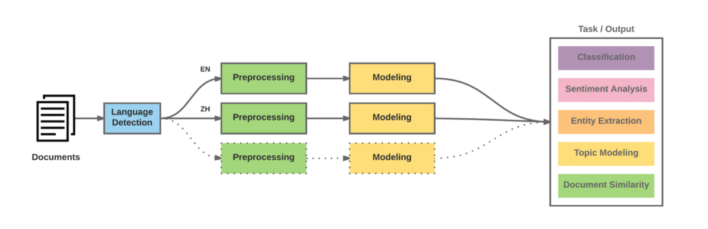
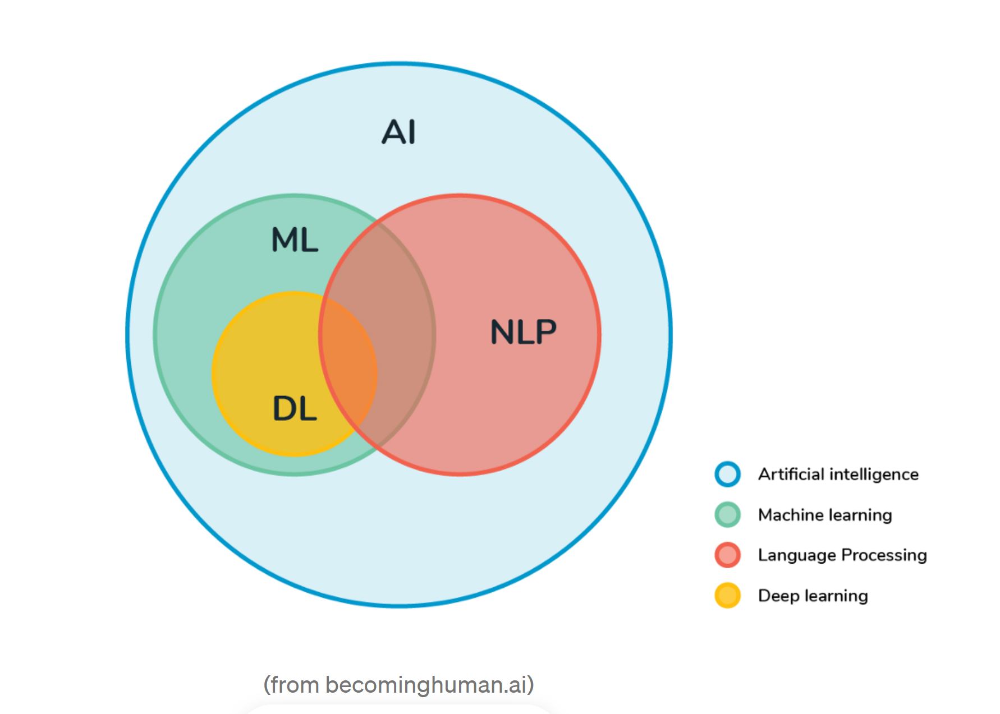

# NLP Skill Tree : 

- NLP STEP : Document --> Language Detection --> Preprocessing --> Modeling --> TasK/Output

- 底下提供一張我個人覺得畫得很好的圖，完美詮釋NLP與其他資訊科學領域的交集關係。 

## 1.Preprocessing(預/前處理) : 
- 以NLP來說，preprocessing通常包含兩個重要工作：爬蟲(crawling)及斷詞(tokenization)。
    - 1.crawling : 
        - 常用的爬蟲套件有requests和Beautiful Soup等等
    - 2.tokenization( = word segmentation) : 
        - Data cleaning
        - Word Cut, tokenization
        - stemming?!!
        - NLTK(Natural Language Tool Kit)
        - StopWords
        - vectorization (apply CountVectorizer) -> from sklearn.feature_extraction.text import CountVectorizer
        - !中文的tokenization特別會有粒度(granularity)的問題-> 相較英文，中文多了好幾種不同的斷詞方式。這是因為在中文裡，並沒有像英文裡空白的機制可以用來區分字與字之間的間隔。[Reference](https://medium.com/@derekliao_62575/nlp%E7%9A%84%E5%9F%BA%E6%9C%AC%E5%9F%B7%E8%A1%8C%E6%AD%A5%E9%A9%9F-i-%E8%AA%9E%E6%96%99%E7%9A%84%E9%A0%90%E8%99%95%E7%90%86-preprocessing-8538f0b763d6)

## 2.Modeling(Language Models 建立語言模型) : 其實語言模型指的就是一種將文字轉為數字表達的方法。
    - BoW(詞袋模型) : By using "One-hot encoding"
        - 傳統BOW的缺點非常多 :
            - A.容易造成維度災難(curse of dimensionality)
            - B.向量表達過於稀疏(sparse)
            - C.無法表達語意
    
    - 因此Word2vec有了升級版BOW Model-> TF-IDF/ CBoW
        - TF-IDF
        - CBoW(Continuous Bag of Words)
    
    - 其餘 Model 架構 : 
        - CNN
        - RNN
        - LSTM
        - GloVe

## 3.Run and take the Result(執行任務/產出結果) : 

## 4.評估方法 :
    - BLEU
    - ROUGE : Rouge-N/ Rouge-L/ Rouge-W
    - METEOR
    - CIDEr

## 5. Apply(應用方向)

- A.文字分類(Text Classification)：例如情緒分析(Sentiment Analysis)、主題的分類、垃圾信(Spam)的辨識、...等，乃至於聊天機器人(ChatBot)。
- B.文字生成(Text Generation)：例如文本摘要(Text Summary)、作詞、作曲、製造假新聞(Fake News)、影像標題(Image captioning)...等。
- C.翻譯(Text Translation)：多國語言互轉。
- D.其他：克漏字、錯字更正、命名實體識別（NER）、著作風格的比對，例如紅樓夢最後幾個章節是不是曹雪芹寫的。